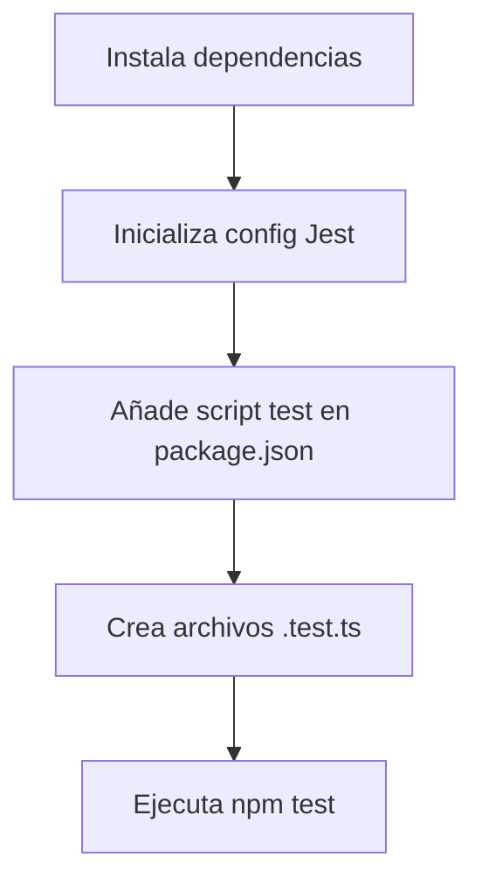

# Configuración de Tests Unitarios en Backend con Jest y TypeScript

Este documento describe cómo preparar el entorno del backend (Node.js + TypeScript) para ejecutar tests unitarios usando **Jest** y **ts-jest**.

---

## 1. Instalación de dependencias necesarias

Ejecuta el siguiente comando en la carpeta `backend` para instalar Jest, ts-jest, typescript y los tipos de Jest como dependencias de desarrollo:

```sh
npm install --save-dev jest ts-jest typescript @types/jest
```

---

## 2. Inicialización de la configuración de Jest para TypeScript

Genera el archivo de configuración de Jest adaptado a TypeScript con:

```sh
npx ts-jest config:init
```

Esto creará un archivo `jest.config.js` en la raíz de `backend/`.

---

## 3. Configuración del script de test en package.json

Asegúrate de que en el archivo `backend/package.json` exista el siguiente script:

```json
"scripts": {
  "test": "jest"
}
```

---

## 4. Estructura recomendada para los tests

Puedes ubicar los archivos de test de dos formas:

- En una carpeta dedicada, por ejemplo: `src/tests/`
- Junto al archivo a testear, usando la extensión `.test.ts` o `.spec.ts`.

Ejemplo:
- `src/application/services/candidateService.test.ts`

---

## 5. Ejecución de los tests

Para correr los tests, ejecuta:

```sh
npm test
```

Esto ejecutará todos los archivos que terminen en `.test.ts` o `.spec.ts`.

---

## 6. Recursos útiles

- [Guía básica de Unit Testing con Jest (Medium, español)](https://medium.com/@angelygranados/c%C3%B3mo-empezar-a-hacer-unit-testing-con-jest-gu%C3%ADa-b%C3%A1sica-ca6d9654672)
- [Documentación oficial de Jest](https://jestjs.io/docs/getting-started)
- [ts-jest (TypeScript + Jest)](https://github.com/kulshekhar/ts-jest)

---

## 7. Resumen visual del flujo



---

¡Listo! Ahora tu backend está preparado para pruebas unitarias con Jest y TypeScript. 